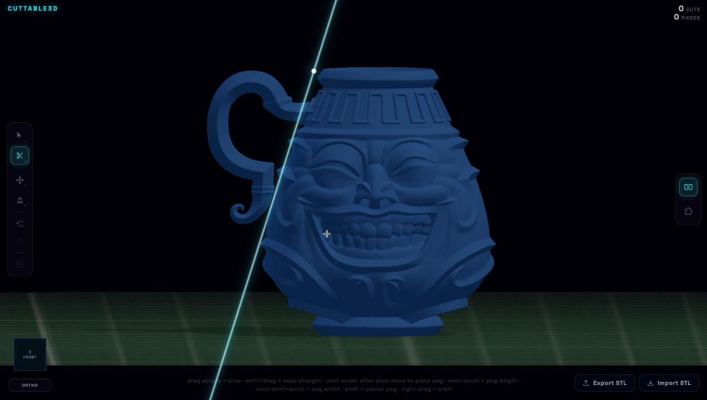

# Cuttable3D

> Browser-based 3D model slicing tool for print preparation. Prototype / research.


https://github.com/user-attachments/assets/365be641-525c-45e8-b0bc-0a8185407475


**[Live Preview](https://rendyrayana.github.io/cuttable3d)** · **[Project Page](https://rendyrayana.my.id/cuttable3d)** · [Rendy Rayana](https://rendyrayana.my.id)

## Overview

Cuttable3D is a browser-based tool for slicing STL models into separate parts in preparation for 3D printing. It lets you draw a cut line directly on the model, inspect the resulting pieces with real rigid-body physics, add snap-fit peg joints at cut faces, and verify that all parts reassemble correctly using an interactive puzzle mode. Built as a prototype to explore geometry processing and physics-based interaction in the browser.

## Screenshots



## Features

- Freehand straight-line cuts with automatic plane detection
- Snap-fit peg joints generated at cut faces
- Real rigid-body physics: pieces fall, bounce, and can be picked up and thrown
- Puzzle mode: ghost outlines mark each piece's original position; drag to snap back
- Scroll to rotate pieces while dragging in puzzle mode (Y axis; Cmd+Scroll for X)
- Isolation mode with transform gizmo for precise repositioning
- Unlimited undo / redo

## What Makes This Different

Most browser-based 3D tools treat geometry statically. Cuttable3D combines CSG boolean operations with a live physics simulation, so cut results are immediately interactive rather than just visual. The puzzle mode provides a lightweight way to verify that a multi-part split will reassemble correctly before sending to a printer, without leaving the browser.

## Requirements

- Node.js 18+
- Modern browser with WebAssembly support (Chrome, Firefox, Safari)

## Getting Started

```bash
git clone https://github.com/rendyrayana/Cuttable3D
cd Cuttable3D
npm install
npm run dev
```

Open `http://localhost:5173`. A sample model loads automatically.

## Tech Stack

| Library / Tool | Role |
|---|---|
| [Three.js](https://threejs.org) v0.179 | 3D rendering and post-processing |
| [Rapier](https://rapier.rs) 3D | WASM rigid-body physics simulation |
| [three-bvh-csg](https://github.com/gkjohnson/three-bvh-csg) | Mesh boolean operations for cuts |
| [manifold-3d](https://github.com/elalish/manifold) | Manifold geometry for cut cap faces |
| [Vite](https://vitejs.dev) | Dev server and build tooling |

## Status

`Prototype`. Built as part of ongoing exploration into browser-based geometry tools. Not production-ready. Feedback and issues welcome.

## License

[MIT](LICENSE)

## Links

- **Live Preview:** [rendyrayana.github.io/cuttable3d](https://rendyrayana.github.io/cuttable3d)
- **Project Page:** [rendyrayana.my.id/cuttable3d](https://rendyrayana.my.id/cuttable3d)
- **More projects:** [rendyrayana.my.id](https://rendyrayana.my.id)
